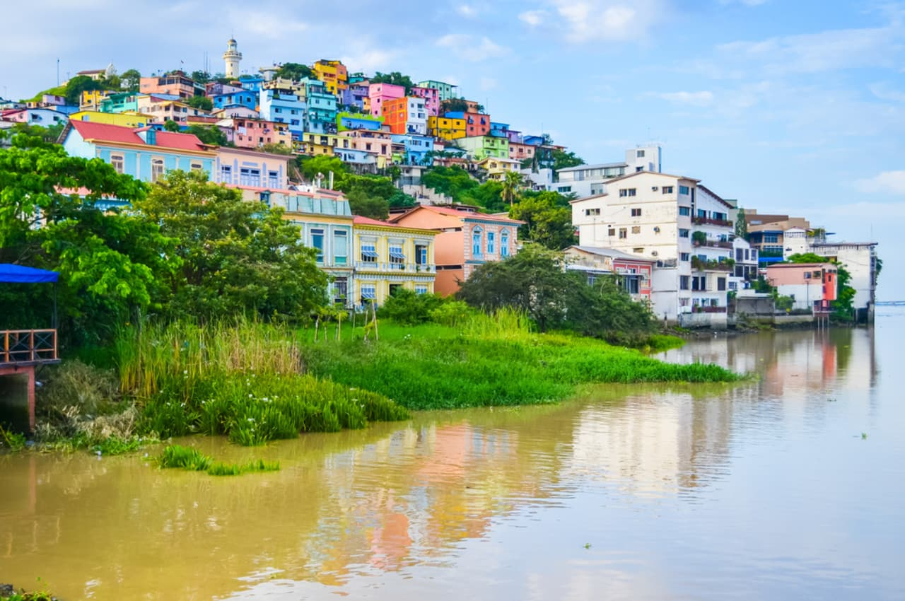
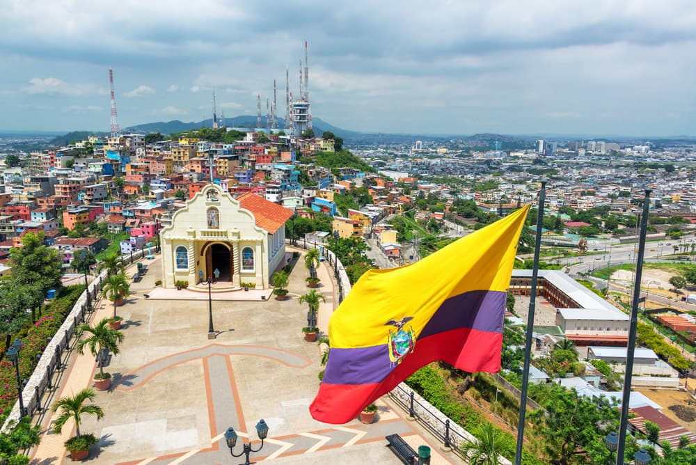
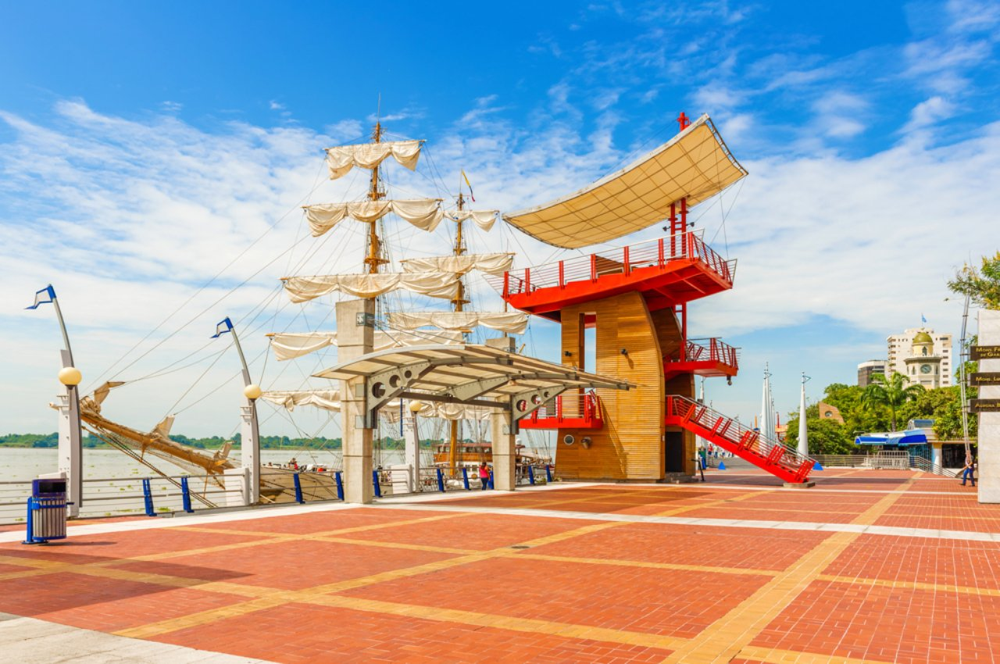

# Guayaquil
Guayaquil, oficialmente Santiago de Guayaquil, es la ciudad capital de la Provincia del Guayas y cabecera del cantón homónimo. Es la segunda ciudad más poblada de Ecuador, después de Quito, la capital del país, con una población de 2.7 millones de habitantes de acuerdo a las proyecciones poblacionales del Instituto Nacional de Estadística y Censos (INEC). Es el principal centro económico, de recursos culturales y financieros de la costa ecuatoriana.
Se encuentra ubicada en la costa del Océano Pacífico en la región litoral de Ecuador. La zona este de Guayaquil está a orillas del río Guayas, a unos 20 kilómetros de su desembocadura en el Océano Pacífico. Está rodeada por el Estero Salado en su parte suroccidental y el inicio de la cordillera Chongón Colonche, una cadena de montañas de altitud media, en el noroeste. El golfo de Guayaquil es la entrante de agua más grande del océano Pacífico en Sudamérica, sus salientes extremas se fijan en cabo Blanco, en Perú, y la provincia de Santa Elena. cubriendo una distancia de 230 km.
La ciudad se divide en 16 parroquias urbanas, aunque dentro de una nueva administración municipal, su organización consiste de 74 sectores. La ciudad de Guayaquil se extiende por 347 km² de superficie, de los cuales 316 km², equivalentes al 91,9 % del total, pertenecen a la tierra firme (suelo); mientras que los restantes 29 km², equivalentes al 8,1 %, pertenecen a los cuerpos de agua que comprenden ríos y esteros. La conurbación de Guayaquil, que es el área metropolitana de Guayaquil, más allá de los límites de la aglomeración urbana, incluye las ciudades de Milagro, Daule, Playas, entre otras, dándole una población consolidada de 3 113 725 habitantes.
Fundada definitivamente en 1547 como astillero y puerto comercial al servicio de la Corona española, como "Santiago de Guayaquil", luego de varios otros intentos de fundación, ha servido de punto principal en la economía de la nación.10​ Ha sido sede de grandes revoluciones y levantamientos en el curso de la historia, siendo la primera ciudad ecuatoriana en obtener de forma definitiva su independencia de España en 1820. Luego fue capital de la Provincia Libre de Guayaquil, que más tarde fue anexada a la Gran Colombia. Desde 1830 forma parte de la República del Ecuador como importante eje económico y político.
La revolución de marzo que expulsó el militarismo extranjero, la revolución liberal liderada por el general Eloy Alfaro, la revolución de mayo que cambió el gobierno y la Constitución de la época, son importantes sucesos en la historia de la nación que se han desarrollado en la ciudad. Santiago de Guayaquil se destaca entre las ciudades ecuatorianas por su elevado uso de tránsito masivo, y por su densidad total y la diversidad de su población. El puerto de la ciudad es uno de los más importantes de la costa del Pacífico oriental. El 70 % de las exportaciones privadas del país sale por sus instalaciones, ingresando el 83 % de las importaciones.

## Barrio las Peñas 

## Cerro Santa Ana

## Malecon 2000

